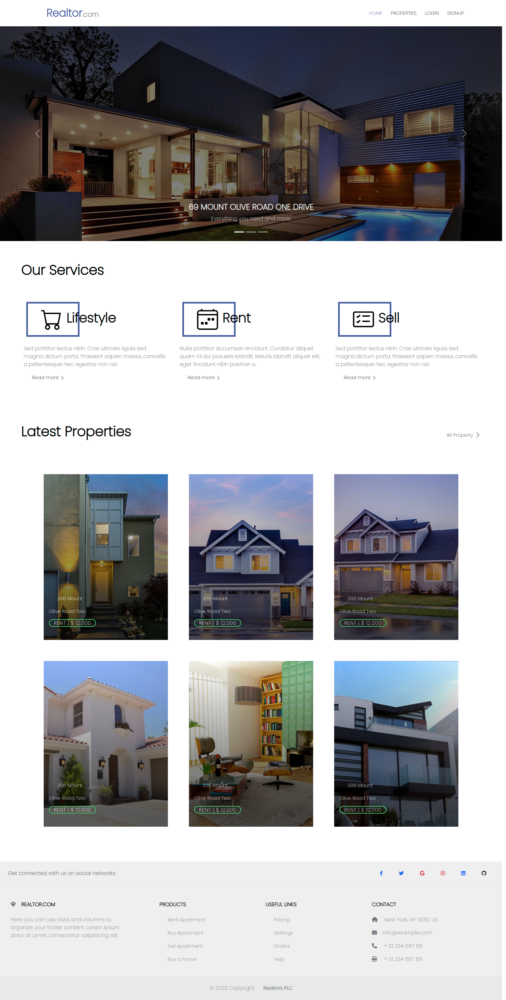
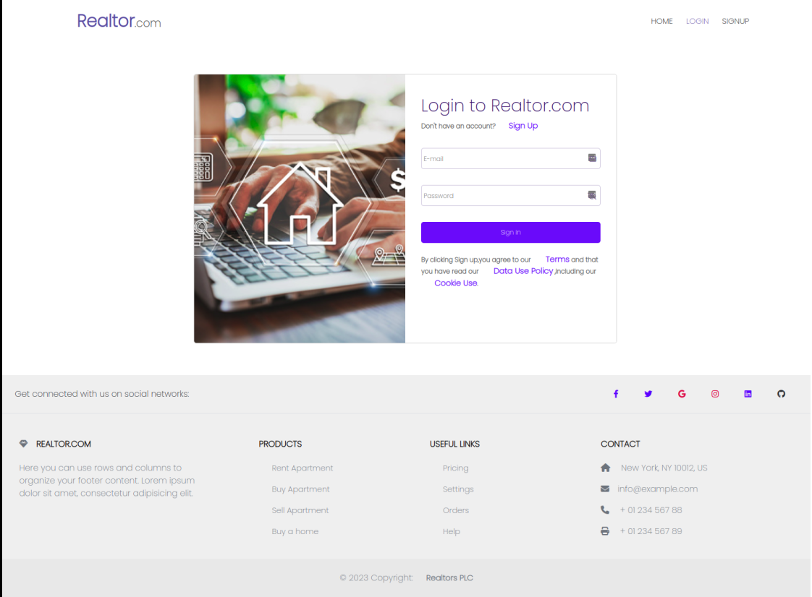
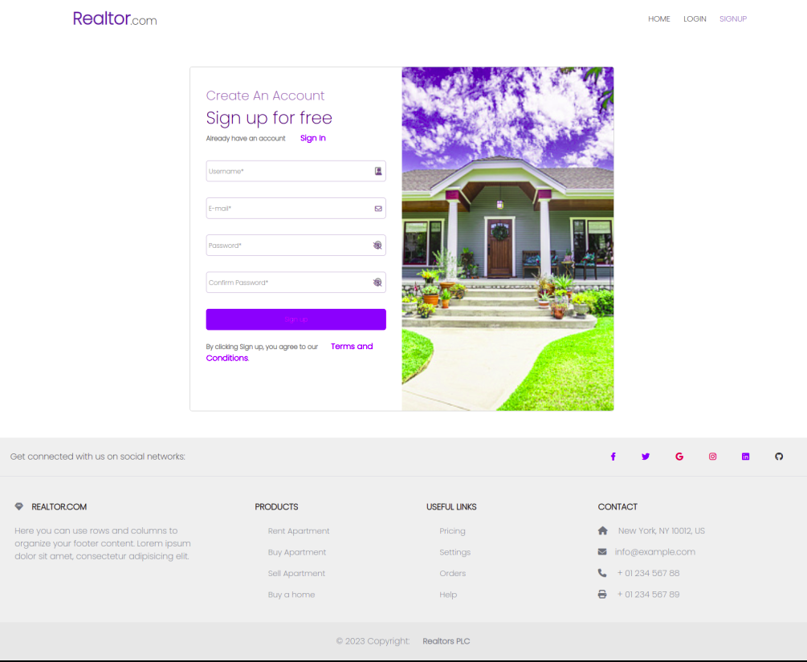

# Realtor.com
Created by Emilly Sereya Tiampati on 31/03/2023

## Description
Realtor.com is a a website that provides a way to create, update, delete and retrieve listings/properties. It also provides a way to create and retrieve a user. It is built with React on the front-end and uses React Router for client side routing and Ruby on Rails API on the backend . 

### Figma Design
[Figma](https://www.figma.com/file/KjCxyeq5ekDAotQpoqHbLf/REIS---Real-State-Listing-Figma?node-id=0-1&t=2RwzFTYsaICVL4C9-0)

### Separate Repositories
This project was deployed on different platforms namely [vercel](https://vercel.com/) and [render](https://render.com/)

Front end
* [Realtor.com React Client Gitbub Repository ](https://github.com/sereyatiampati/Realtor-React-Front-end)
* [Deployed live link](https://realtor-sereyatiampati.vercel.app/)

Back end
* [Realtor.com Rails Server API Gitbub Repository ](https://github.com/sereyatiampati/Realtor-Rails-API-Backend)
* [Deployed live link for one of the endpoints](https://realtor-com.onrender.com/listings) 

### Setup Requirements
* Ruby 3.0.0 or higher
* Rails 6.1.0 or higher
* SQLite
* NPM
* Node.js
* Web-browser of your choice

### Technologies used in this project:
- React
- React Router
- Bootstrap
- CSS
- HTML
- Ruby on Rails

### How to Set up
1. Clone this repository `git clone git@github.com:sereyatiampati/Realtor.com.git`
2. Change directory  to the cloned repo `cd Realtor.com`
3. Run `bundle install` to install the Rails API dependencies 
4. Run `rails server` to start the server
5. Run `npm install --prefix client` to install dependencies for the react frontend application
6. Run `npm start --prefix client` to start the react frontend 

### Features
Users
* ability to create/signup/register a user and login
* persistent login using cookies
* ability to update user information and view listings
* ability to add a listing/property
* ability to update listings added by the user
* ability to delete a listing
* ability to delete your own profile

App

* responsive design
* view best sellers in carousels
* View listings

## Front-end Sample Design
* Landing page

* Login

* Signup

  ### Contact
  [See contacts](https://github.com/sereyatiampati)

  ### Licence
  Distributed under the MIT License. See `LICENSE.md` for more information.

  Copyright © 2023. All rights reserved.